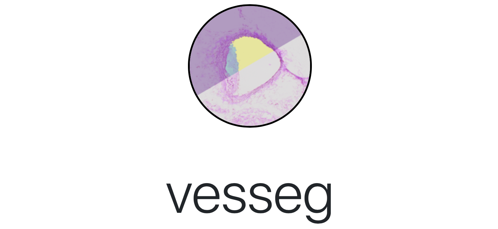

# Vesseg

This repository contains the source files associated with the _vesseg_ (*ves*sel *seg*mentation) platform. They can be downloaded for set-up with `Docker` both locally and on a server. The vesseg platform is described in: 

>*Murray JM, Pfeffer P, Seifert R, et al. Vesseg: An Open-Source Tool for Deep Learning-Based Atherosclerotic Plaque Quantification in Histopathology Image. ATVB. Published online August 12, 2021. doi:10.1161/ATVBAHA.121.316124*

The analysis files associated with the above mentioned paper can be found here.

___

## Table of Contents
1. [Docker Set-Up](#Docker-Set-Up)
2. [Running Vesseg Locally](#Running-Vesseg-Locally)
3. [Adding Models](#Adding-Models)
4. [FAQ](#FAQ)
___
## Docker Set-Up
Exact instructions on how to set-up `Docker` in different computing environments can be found [here](https://docs.docker.com). The following is only meant to serve as a quick-start guide and pertains to Ubuntu, for machines for which you have administrator rights (`sudo` privileges). The following two steps are needed.

1. [Set-up Docker community edition](https://docs.docker.com/engine/install/ubuntu/)
2. [Set-up Docker compose](https://docs.docker.com/compose/install/)

## Running Vesseg Locally
1. Clone this repository to your local machine that has `Docker` and `Docker compose` installed. 
```
git clone https://github.com/jacobmatthewmurray/vesseg.git
```
2. Change directory into the app directory. 
```
cd app/
````
3. Run helper script to build all `Docker` containers needed for the local installation (all except for "server"). This will take some time and requires `Docker` to have access to sufficient RAM resources.

```
./utils/build_all_container.sh docker_launcher fastai_predictor file_type_converter frontend nnunet_cpu_predictor processor
```
4. Once containers have completed building, make sure to edit `./utils/docker-compose.yml` to reflect your individual system, i.e., set data directory and secret key. (If running on a server, configure `sawg` container (advanced).)

5. Run your vesseg platform locally by `cd ./app/utils` and running (for details on `docker-compose` visit the [docs](https://docs.docker.com/compose/reference/up/)): 
```
docker-compose up
``` 

6. You should then be able to visit vesseg locally at http://localhost:8000! 

7. This sets up the platform, but it does not contain (pre-trained) models. To add these, continue reading.

## Adding Models

To add a model, you must have admin privileges to your locally running vesseg platform. The first user to create an account automatically gains admin status. Assigning admin status to other users is a feature that will be added in coming iterations.

1. Download models:
    1. Pretrained `fastai` model, [here](https://vesseg.online/download/fastai_01.zip).
    2. Pretrained `nnunet` model, [here](https://vesseg.online/download/nnunet112.zip).
2. Once downloaded, extract the models into a "models" subdirectory of the "data" directory as specified in docker-compose file. 
3. Now that the models are physically available to the platform they still need to be linked up. In the admin area of the platform (after log in, click on your username in the top right-hand corner) select models. Add the models as follows:
    1. fastai: 
        * model name: fastai (or a name of your choosing)
        * container: fastai_predictor:latest (must be this exactly, as it refers to the fastai prediction container module) 
        * path: fastai_01 (or name of the top level folder of your extracted files)
        * addtl args: leave this blank
    2. nnunet: 
        * model name: nnunet_112 (or a name of your choosing)
        * container: nnunet_cpu_predictor:latest (must be this exactly, as it refers to the prediction container module)
        * path: nnUNet_trained_models (must be this, corresponding to top level container of extracted files)
        * addtl args: -t 112 (this must correspond to the trained nnunet Task, see [here](https://github.com/MIC-DKFZ/nnUNet) for details)
4. This makes the models available for prediction! Other models trained with fastai or nnunet can be added in the same fashion.

## FAQ
1. Questions? Please feel free to direct them at jacobmatthewmurray at gmail dot com


